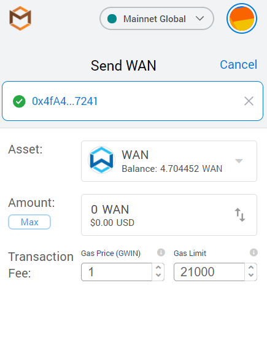
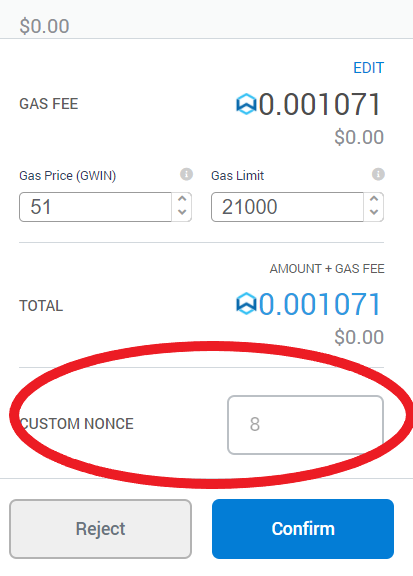

# How to Fix a Stuck Pending Transaction on WanSwap

_In this guide, we will show you how to get rid of a stuck pending transaction using WanMask._

When you have a stuck pending transaction you can follow these steps to cancel it

### Enabling Advanced Settings for Gas and Nonce

Open your WanMask wallet extension, then click on the icon in the top-right and click on Settings. Go to advanced, and enable Advanced gas controls.  

After that enable 'Customize transaction nonce'.  
    

Now scroll all the way down and click 'Save'.

### Finding out transaction nonce

Now we need the pending transaction nonce, you can find all stuck transactions on this page. Check for your transaction and note the nonce number.

### Submitting an empty transaction

- Open the WanMask extension  

- Copy your address by clicking on your account name  

- Click send  

- Paste your address  

- Make sure the amount is on 0 and click next

- Edit the gas fee

  

- Choose the 'Fast' option and save (make sure you use slightly more gas than on the stuck pending transaction)

- Enter the nonce number in the custom nonce field

  

- Click confirm

If everything was done correctly the stuck transaction should now be gone.
