# Contribute

The Wanswap documentation is built using [Docsify](https://docsify.js.org/), and makes use of the [docsify-themeable](https://jhildenbiddle.github.io/docsify-themeable/#/) theming system. 

In order to contribute to the docs, fork the original [repo](https://github.com/wanswap/wanswap-docs), make changes locally, commit and push changes to your fork, and finally submit a pull request in order to merge your changes and get them pushed live. After submitting a pull request, please check to see if your request was accepted. Requests will generally be accepted within a few days. If your request is not accepted, check the comments to see what you need to modify to get your request accepted.Leland

## Prerequisites

1. Install [NodeJS](https://nodejs.org/en/). Most NodeJS installs include [NPM](https://www.npmjs.com/), if your version does not include NPM, make sure to install that as well.

1. [Install git](https://git-scm.com/book/en/v2/Getting-Started-Installing-Git).

1. [Add ssh key](https://docs.github.com/en/free-pro-team@latest/github/authenticating-to-github/generating-a-new-ssh-key-and-adding-it-to-the-ssh-agent) to your GitHub account.

1. Familiarize yourself with [Markdown syntax](https://www.markdownguide.org/).

## Contribution Process

### 1. Fork the FinNexus Docs repo to your own account by clicking the "Fork" button.
  [FinNexus docs repo link](https://github.com/FinNexusFinNexus-Documentation)

  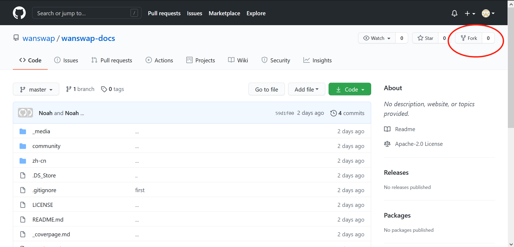  

### 2. Set up for editing

You may either edit locally on your own machine or edit directly on GitHub.

**OPTION A - Clone locally:**  

1. From your terminal, `cd` into the directory of your choice and clone your forked version locally:

> `git clone https://github.com/{your usernam}/FinNexus-Documentation.git`

2. Open the project using a text editor of your choice. [VS Code](https://code.visualstudio.com/) is very popular, while [Typora](https://typora.io/) is an excellent choice for editing Markdown.

3. Install Docsify CLI from terminal:

> `npm i docsify-cli -g`

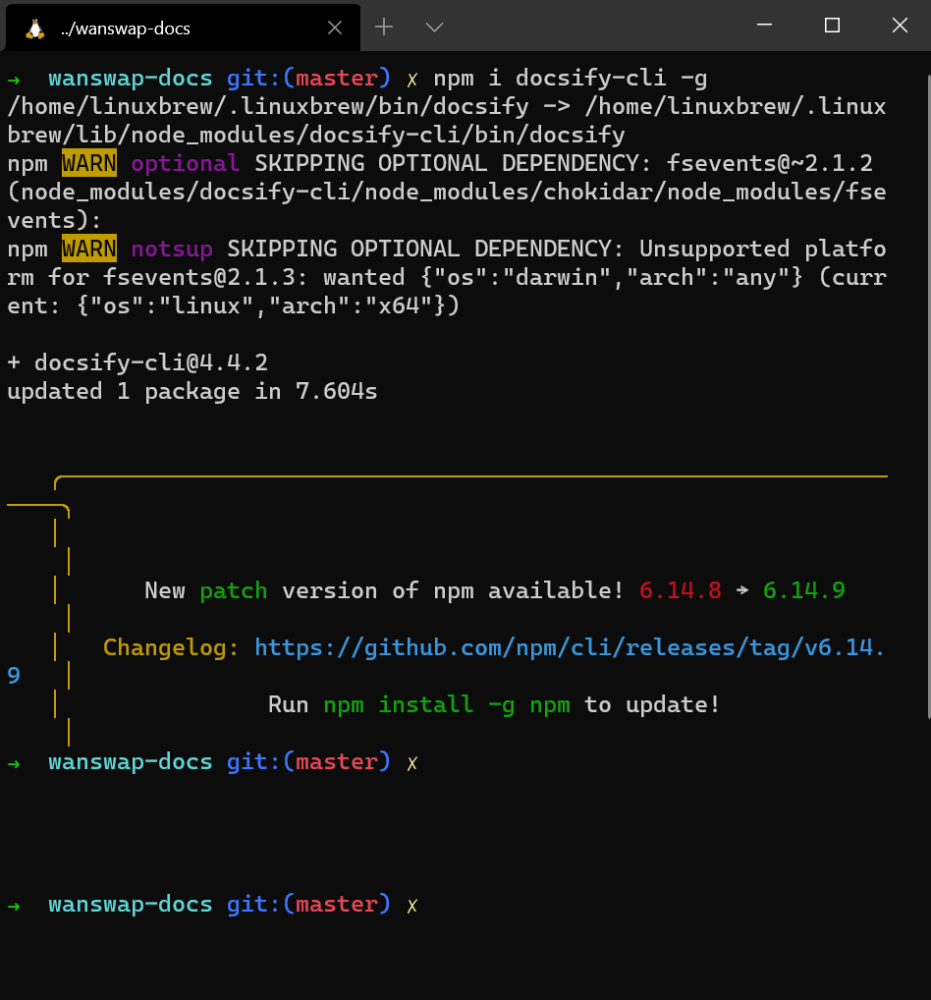

4. From inside the project directory, run local dev server to preview changes:

> `docsify serve docs`

5. Preview the website at URL shown in the terminal output. The URL is [http://localhost:3000](http://localhost:3000) by default, but will be assigned a different URL if that one is already in use.

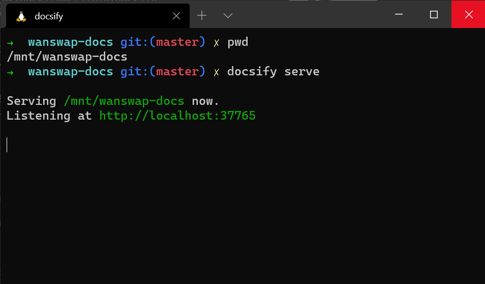

**OPTION B - Edit directly on GitHub**  
Simply navigate to the file you wish to edit and click the edit button:  

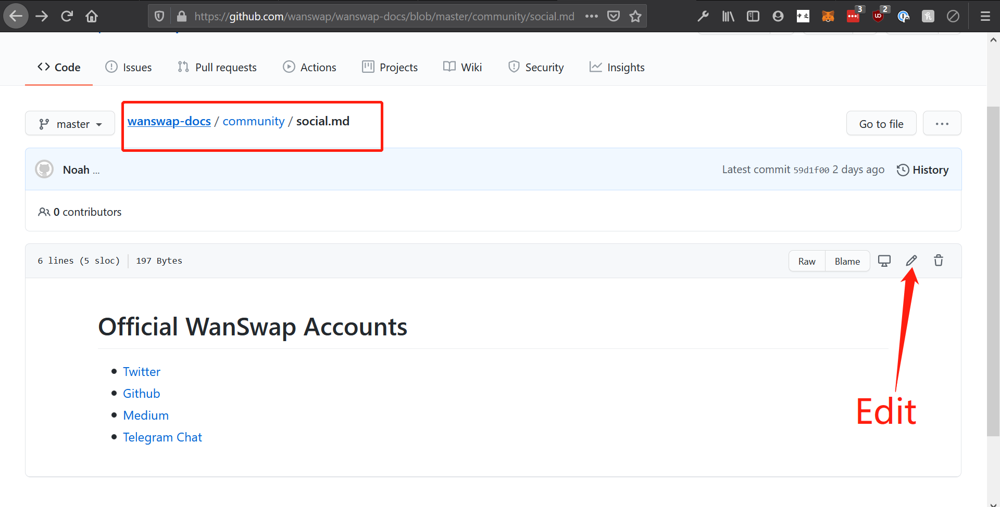  

### 3. Make changes, commit, and push

**OPTION A - Edit locally:**  

In your text editor of choice, write your changes in Markdown. You may preview changes using the URL from the previous step in your browser.

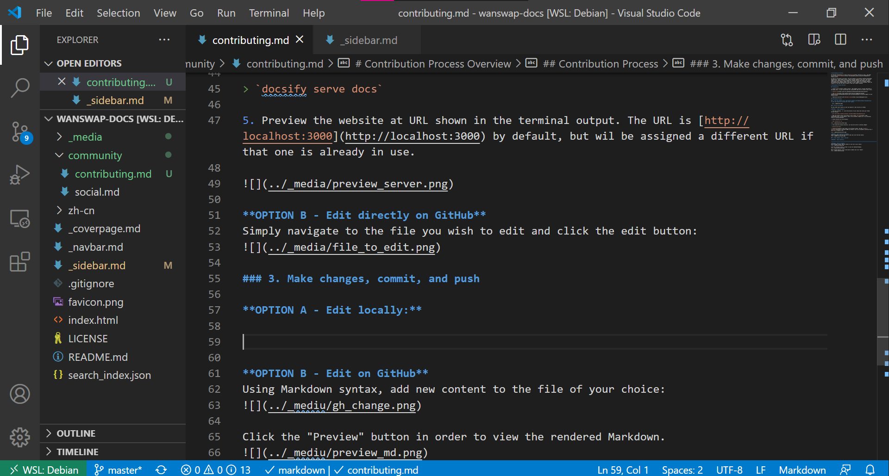

When you are satisfied with your changes, input the following git commands:

```
$ git add *
$ git commit -m "Write a message describing your changes"
$ git push
```

**OPTION B - Edit on GitHub**  
Using Markdown syntax, add new content to the file of your choice:
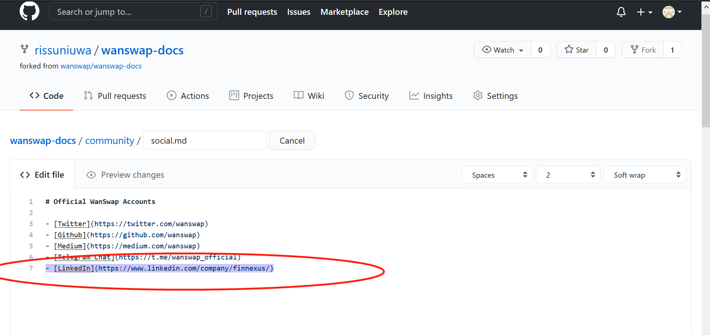

Click the "Preview" button in order to view the rendered Markdown. 


When finished editing, write a descriptive comment and click "Commit"
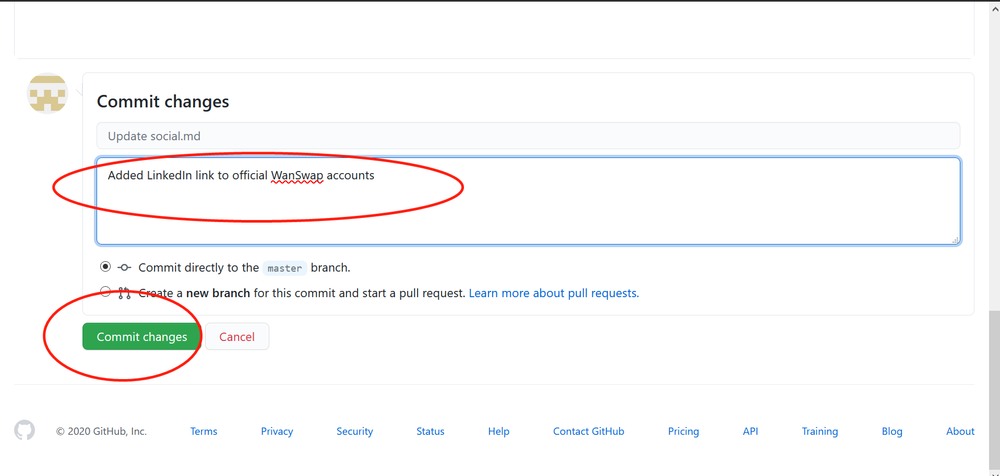

### Pull Request

In this final step you will request to have your changes added from your forked repo to the official Wanswap documentation repo. As soon as the Wanswap documentation repo manager accepts your changes, they will be pushed live.

1. Click "Pull requests":

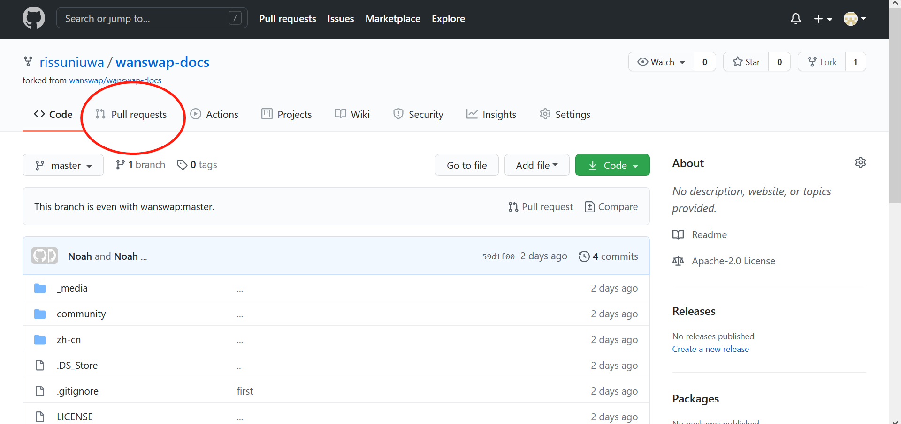

2. Click "New pull request":

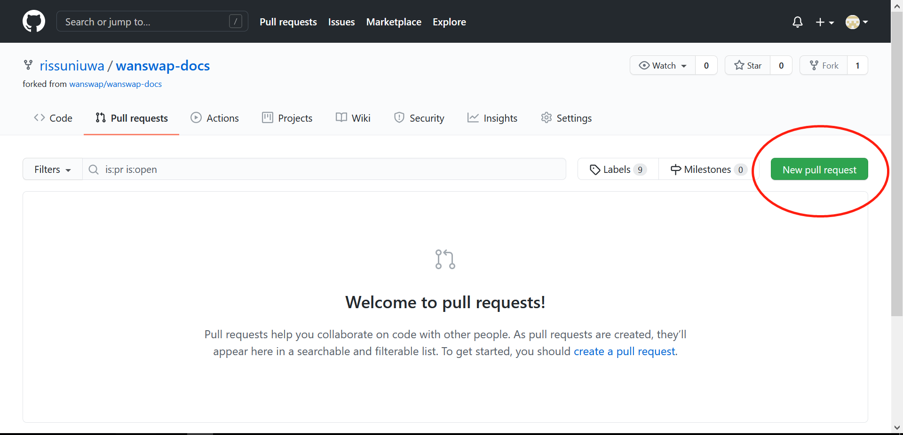

3. Fill in PR title, comment, and finally click "Create pull request":

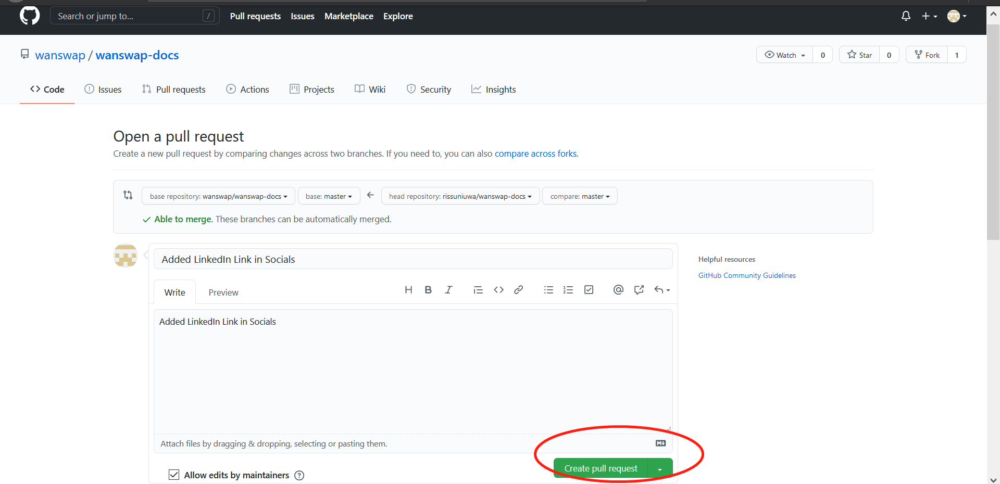

4. The next screen shows you the results of your pull request. Over the next several days, the Wanswap documentation maintainer will review your request and accept it and the changes will go live if there are no problems. If there are some problems, the maintainer will respond to your request with comments explaining how you must change your PR.

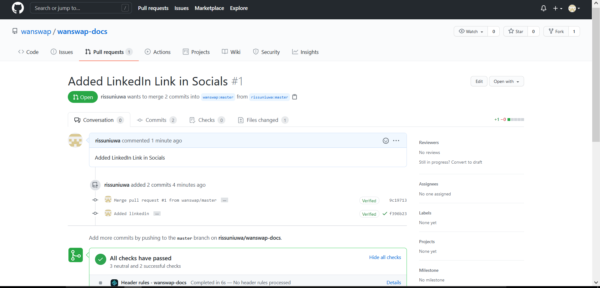